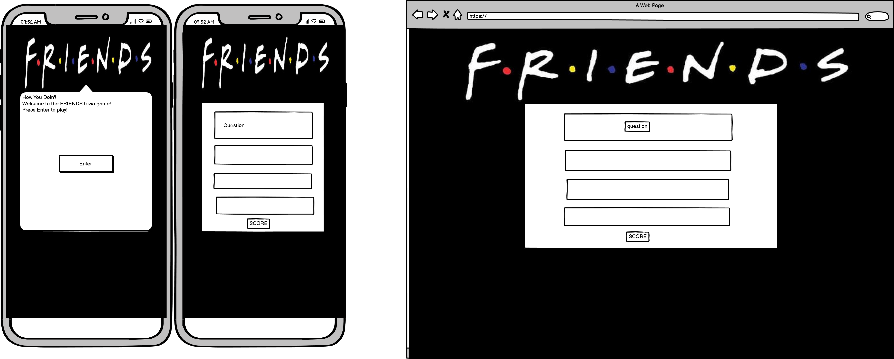

# Friends Quiz Game
This is a Trivia Quiz Game for fans of the popular TV show Friends. 

## User Experience

- User Stories
  
  - First time visitor Goals
    - As a first time visitor I want to learn how to play the game.
    - As a first time visitor I want to navigate easily through the game.
    - As a first time visitor I want to be able to see my score.
  
  - Returning Visitor Goals
    - As a returning visitor I want to be able to answer different questions.
    - As a returning visitor I want to be able to see my progress/score and compare previous playthroughs.
    - As a returning visitor I want to be able to bypass instructional sections.
  
  - Frequent Visitor Goals
    - As a returning visitor I want to be able to play new questions.
    - As a returning visitor I want to be able to see how my scores compare to other users.

- Design
  
  - Colour Scheme
  
  - Typography
  
  - Imagery
  
- Wireframes
  
  

## Features

## Technologies Used

### Languages Used

### Frameworks, Libraries & Programs Used

## Testing

### Testing User Stories from the User Experience (UX) Section
    
### Further Testing

### Known Bugs

## Deployment

### GitHub Pages

The project was deployed to GitHub Pages using the following steps...

Log in to GitHub and locate the GitHub Repository
At the top of the Repository (not top of page), locate the "Settings" Button on the menu.
Scroll down the Settings page until you locate the "GitHub Pages" Section.
Under "Source", click the dropdown called "None" and select "Main", then "Save".
The page will automatically refresh.
The now published site link  will be at the top of the "GitHub Pages" section.

### Forking the GitHub Repository

By forking the GitHub Repository we make a copy of the original repository on our GitHub account to view and/or make changes without affecting the original repository by using the following steps...

Log in to GitHub and locate the GitHub Repository
At the top of the Repository (not top of page) just above the "Settings" Button on the menu, locate the "Fork" Button.
You should now have a copy of the original repository in your GitHub account.

### Making a Local Clone

Log in to GitHub and locate the GitHub Repository
Under the repository name, click "Clone or download".
To clone the repository using HTTPS, under "Clone with HTTPS", copy the link.
Open Git Bash
Change the current working directory to the location where you want the cloned directory to be made.
Type git clone, and then paste the URL you copied in Step 3.
Press Enter. Your local clone will be created.

## Credits

### Code

  
### Content

### Media

### Acknowledgements