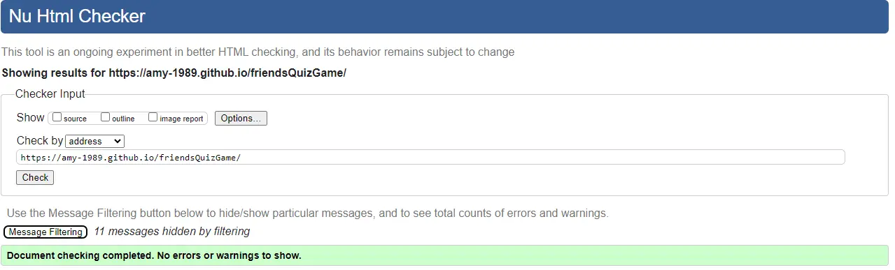

# Friends Quiz Game

This is a Trivia Quiz Game for fans of the popular TV show Friends.

## User Experience

- User Stories

  - First time visitor Goals

    - As a first time visitor I want to learn how to play the game.
    - As a first time visitor I want to navigate easily through the game.
    - As a first time visitor I want to be able to see my score.

  - Returning Visitor Goals

    - As a returning visitor I want to be able to answer different questions.
    - As a returning visitor I want to be able to see my progress/score and compare previous playthroughs.
    - As a returning visitor I want to be able to bypass instructional sections.

  - Frequent Visitor Goals
    - As a returning visitor I want to be able to play new questions.
    - As a returning visitor I want to be able to see how my scores compare to other users.

- Design

  - Colour Scheme

    - The colour scheme was chosen to compliment the theme of the quiz. Colours were taken from the Friends TV show colour palette, with consideration taken for accessibility. The main colours used are black, purple & yellow.

  - Typography

    - The Caveat font from Google Fonts was chosen with Sans-Serif as a backup. This was chosen due to its similarity to the Friends logo and is also easy to read.

  - Imagery
    - As this is a quiz game, imagery has been kept simple with the use of a single Friends Tv Show logo to convey the theme of the quiz game.

- Wireframes

  

## Features

- Responsive on a range of devices
- Interactive Elements
- Leaderboard to track high scores

## Technologies Used

### Languages Used

-HTML
-CSS
-Javascript

### Frameworks, Libraries & Programs Used

1. Google Fonts:

- Google fonts were used to link the 'tapestry' & 'pt-serif' font into the .html files, which is used on all pages throughout the project.

2. Git

- Git was used for version control by utilizing the Gitpod terminal to commit to Git & push to GitHub.

3. GitHub

- GitHub is used to store the projects code after being pushed from Git.

4. Balsamiq

- Balsamiq was used to create the wireframes during the design process.

## Testing

The W3C Markup Validator and W3C CSS Validator Services were used to validate every page of the project to ensure there were no syntax errors.

JSHint was used to validate the javascript files. No major issues were found.

- W3C Markup Validator
  

- W3C CSS Validator
  

### Testing User Stories from the User Experience (UX) Section

- First time visitor Goals

  - As a first time visitor I want to learn how to play the game.

    - Upon entering the site users arrive on a landing page with a clearly marked instruction button. Once clicked this will display how to play instructions.

  - As a first time visitor I want to navigate easily through the game.

    - The landing page has been designed with simplicity and ease of use in mind. Users are greeted with three buttons clearly labelled Play, Instructions & Leaderboard.
    - If users click for instructions the instruction page will display along with a button to play, allowing the user to jump right into the game without having to navigate backwards. The quiz section has clearly displayed questions and answers and a next button to clearly guide the user through the game.
    - After playing the game users will be greeted with the option to play again also.

  - As a first time visitor I want to be able to see my score.

    - There is a score counter at the bottom of the game area where players can easily see their score as they progress through the game.
    - At the end of the game users are greeted with a message showing their score and an option to add their name to the leaderboard in the event of a high score.

  - Returning Visitor Goals

    - As a returning visitor I want to be able to answer different questions.

      - The game has been designed with 10 questions pulled from a collection of 50 questions to allow for variety upon subsequent playthroughs.

    - As a returning visitor I want to be able to see my progress/score and compare previous playthroughs.

      - Upon finishing the game users are given the option of saving their high score to the leaderboard. Upon entering the site, users can click the leaderboard button on the landing page to view their high scores.

    - As a returning visitor I want to be able to bypass instructional sections.
      - On the landing page the instructions are hidden behind an instruction button, allowing repeat players to begin playing straight away.

  - Frequent Visitor Goals

    - As a returning visitor I want to be able to play new questions.

      - The game has been designed with an array of 50 questions from which 10 are pulled. These questions are stored in a separate js file to allow to easily update the array with more questions as needed to keep the game fresh.

    - As a returning visitor I want to be able to see how my scores compare to other users.
      - There is a leaderboard function which allows users to add their name to the scoreboard. Different users of the same device will be able to compare scores, as scores are saved to local storage.

### Further Testing

- The website was tested on Google Chrome, Microsoft Edge, Safari and Mozilla Firefox browsers.
  

- The website was tested on a variety of devices such as Desktop, Ipad, Iphone and Galaxy phones.
  

  - iPhone SE
    

  - iPad Air
    

  - Samsung Galaxy 8plus
    

- A number of testing was done to ensure that all buttons were working.
- Friends and family were asked to play the game on their own devices, and point out any bugs or issues.
- The website was continuously tested & debugged throughout development using Chrome DevTools.
- The website was tested for Desktop and Mobile performance using Chrome DevTools Lighthouse
  - Desktop Lighthouse Result
    
  - Mobile Lighthouse Result
    
- The site was tested for accessability using WAVE
    

### Known Bugs

- On desktop, if a user clicks in the area around the answer buttons, but ot on an answer itself, the browser disables the answer buttons so the user cannot score a point for that question.

## Deployment

### GitHub Pages

The project was deployed to GitHub Pages using the following steps...

Log in to GitHub and locate the GitHub Repository
At the top of the Repository (not top of page), locate the "Settings" Button on the menu.
Scroll down the Settings page until you locate the "GitHub Pages" Section.
Under "Source", click the dropdown called "None" and select "Main", then "Save".
The page will automatically refresh.
The now published site link will be at the top of the "GitHub Pages" section.

### Forking the GitHub Repository

By forking the GitHub Repository we make a copy of the original repository on our GitHub account to view and/or make changes without affecting the original repository by using the following steps...

Log in to GitHub and locate the GitHub Repository
At the top of the Repository (not top of page) just above the "Settings" Button on the menu, locate the "Fork" Button.
You should now have a copy of the original repository in your GitHub account.

### Making a Local Clone

Log in to GitHub and locate the GitHub Repository
Under the repository name, click "Clone or download".
To clone the repository using HTTPS, under "Clone with HTTPS", copy the link.
Open Git Bash
Change the current working directory to the location where you want the cloned directory to be made.
Type git clone, and then paste the URL you copied in Step 3.
Press Enter. Your local clone will be created.

## Credits

### Code

- The code for the overall quiz was inspired by WebDevSimplified tutorial
  - <https://www.youtube.com/watch?v=riDzcEQbX6k&ab_channel=WebDevSimplified>.
- The code for saving the high score was inspired by youtube tutorial by Brian Design
  - <https://www.youtube.com/watch?v=f4fB9Xg2JEY&ab_channel=BrianDesign>.
- The code for local storage was inspired by this article by Michael Karen
  - <https://michael-karen.medium.com/how-to-save-high-scores-in-local-storage-7860baca9d68>.
- The Fisher-Yates algorithm was introduced to me by my mentor Narender Singh.

### Content

- All content was written by the developer.
- Quiz questions were compiled from the Friends Scene It Board Game.

### Media

- Copyright of the Friends logo belongs to David & Marta Kauffman & WarnerMedia
- The favicon image was taken from Very Ireland.
  
### Acknowledgements

- I would like to thank my mentor Narender for all his help and guidance with this project.
- I would like to thank Tutor Support especially Sarah, for her help in debugging my leaderboard functionality.
